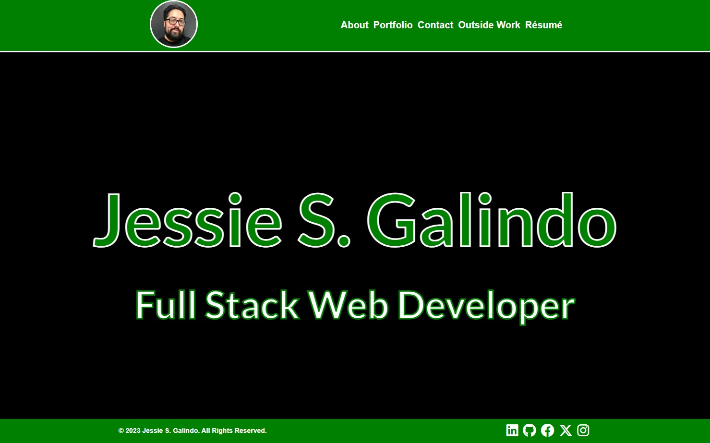
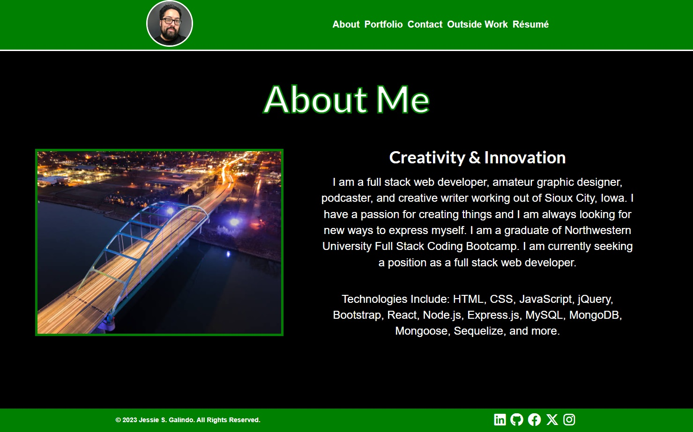
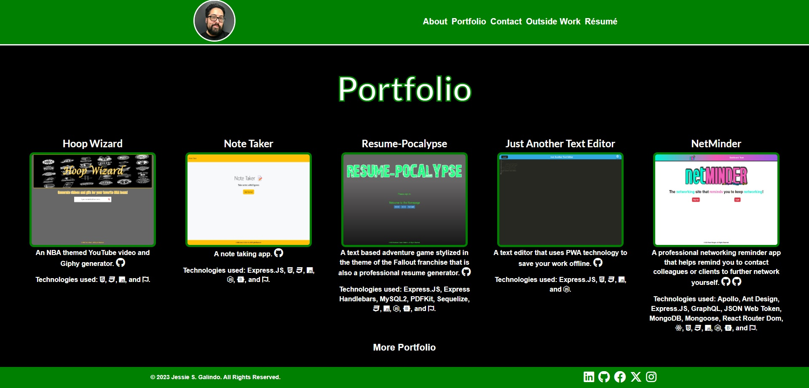
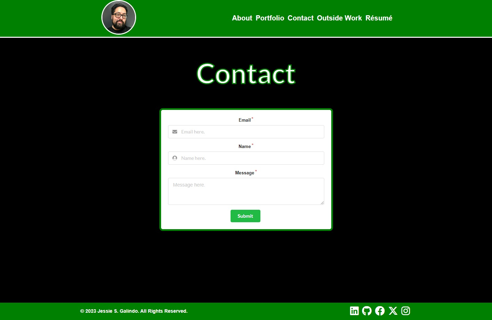

# Jessie Galindo React Portfolio

## Description

I created a portfolio of my work using React. It has a front page banner on the home page, an about me section on the about page, five projects in the portfolio section on the portfolio page with a link to an additional portfolio page with the rest of my projects from the Northwestern University Full Stack Coding Bootcamp, and a contact section on the contact page that is set up with Email.JS in order to send me an email. Also, in the Navbar, there are links to my outside works and my resume. Additonally, I used basic CSS and Font Awesome icons.

## Installation

No installation necessary but you can clone the [repository](https://github.com/MrMessyFace/jessie-galindo-react-portfolio) from GitHub to edit it and make your own version.

## Usage

When a user loads the page, they are able to see a working navbar that has my picture as the home button, links to each section of the page, and a link to my professional resume. Below the navbar, is the banner section containing my name and title. Then an about me section with technologies I have learned. Then a portfolio section with six of my projects that each have a screenshot that is also a link to their live webpage, their title, a short description of the app, a link to the GitHub repository, and the technologies used in the project. There is also a link to a separate page that contains all my other projects. Then there is a contact section that contains a form that allows a user to submit their first and last name, email, phone number, and a message to me. Then there is a footer with my copyright and links to my Linkedin, GitHub, Facebook, Twitter (or X), and Instagram.

## Credits

Code was recreated from [my previous portfolio project](https://github.com/MrMessyFace/jessie-galindo-portfolio) but altered using React.js.

## Helpful Links

- [Repository](https://github.com/MrMessyFace/jessie-galindo-react-portfolio)
- [Live App](https://jessie-galindo-portfolio-fa0dd3079f8a.herokuapp.com/)

&copy; 2023 Jessie S. Galindo. All Rights Reserved.
