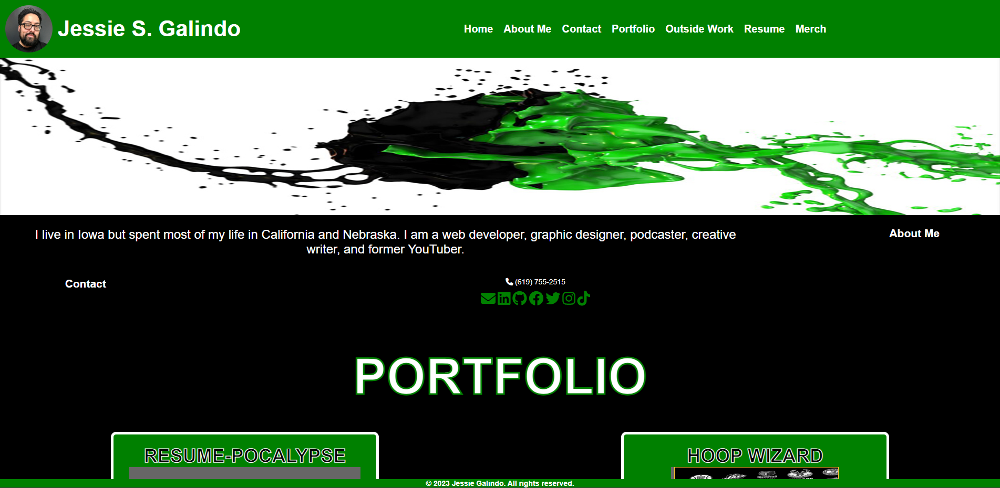

# Jessie Galindo Portfolio 2.0

## Description

My portfolio of work. But upgraded with React!

## Installation

If you choose to install this code on your local system, clone the repository from https://github.com/MrMessyFace/jessie-galindo-portfolio-2.0.

## Usage

When a user loads the page, they are able to see a working navbar that has my name and picture, links to each section of the page, a link to my resume, links to unaffiliated projects, and a link to a merchandise site. There is an About Me section, a Contact section with links to email, LinkedIn, Github, Facebook, Twitter, Instagram, and TikTok, and a Portfolio section with six of my recent projects, each with a link to the deployed site and a link to the Github repository.

## Credits

Code was recreated from my previous portfolio project but altered using React syntax.

https://jessie-galindo-portfolio-fa0dd3079f8a.herokuapp.com/

https://github.com/MrMessyFace/jessie-galindo-portfolio-2.0/